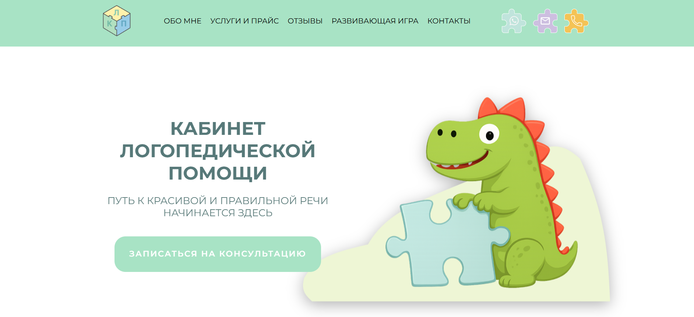

# 🗣️ Сайт кабинета логопедической помощи

Информационный сайт с возможностью записи на консультацию. Проект выполнен с акцентом на удобство пользователей, адаптивность и современный дизайн.

## 📸 Скриншоты

## 📖 Описание проекта

Сайт разработан для кабинета логопедической помощи. Основная цель — предоставить клиентам информацию об услугах, специалистах и упростить процесс обратной связи.

Функционал включает:

- форму обратной связи,
- адаптивную вёрстку,
- анимации с элементами детской тематики,
- слайдер на базе Swiper.js.

## 🎨 Дизайн

Дизайн выполнен в доброжелательной и уютной стилистике, чтобы создать комфортную атмосферу для родителей и детей:

- Акварельные иллюстрации и мягкая цветовая палитра;
- Дружелюбные элементы интерфейса, ассоциирующиеся с заботой и теплом;
- Игровые анимации с динозаврами 🦖, чтобы привлечь внимание детей и вызвать положительные эмоции.

## ✨ Основные возможности

- 📱 Адаптивность — сайт корректно отображается на любых устройствах.
- 💬 Форма обратной связи — быстрая запись на приём.
- 🎞️ Анимации — детские анимации с динозаврами.
- 🎠 Слайдер (Swiper.js) — удобная подача контента.
- ⚡ Оптимизация — быстрый отклик и современный UI.

## 🛠 Технологии

- WordPress (CMS)
- JavaScript (ES6+)
- Swiper.js
- HTML5 / CSS3
- Анимации (CSS/JS)

## 👥 Участники проекта

| Роль                 | GitHub                                              |
| -------------------- | --------------------------------------------------- |
| Тимлид/Фронтенд      | [Daria Demidova](https://github.com/dariaSDemidova) |
| Фронтенд/Дизайн      | [Daria Semina](https://github.com/darina1970)       |
| Фронтенд-разработчик | [Alena Elhel](https://github.com/ochumenno66)       |
| Фронтенд-разработчик | [Nino Markarova](https://github.com/Ninima1218)     |

## 📩 Связь

Если вас заинтересовало сотрудничество, свяжитесь с нашим проджект-менеджером в Telegram:  
👉 [Антонина](https://t.me/msmitor)

## 📄 Лицензия

Этот проект создан в рамках частного коммерческого заказа и не распространяется по открытой лицензии.
